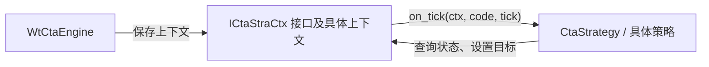

# S001：从零推导策略、上下文与引擎

日期：2026-09-30。参考提交：`08b230dd05facf6d650d949bfe51054115a2ecb1`。

本课选取 WonderTrader 的 CTA 策略体系作为核心设计入口。下面的开发顺序是为学习重新组织的设计推导，不代表上游真实开发历史，也不代表所有引擎共用同一个策略类。

## 从一个需求开始

先规定最小场景：收到某合约的一条行情，策略根据价格决定想持有多少仓位。例如价格低于教学阈值 100 时希望持有 1 手，否则希望持有 0 手。这只是架构演示规则。

一个最初版本可以把读行情、判断条件和打印结果都放进 main。随后逐项增加需求，类的职责才逐渐显现：

| 新需求 | 必须分开的责任 | 本项目将引入的类型 | 上游对应 |
|---|---|---|---|
| 每条行情包含同一组字段 | 行情值的表示 | Tick | WTSStruct.h 中的 WTSTickStruct；策略接收 WTSTickData 指针 |
| 更换交易规则，仍使用同一个驱动循环 | 收到行情后执行哪种算法 | Strategy 与具体派生类 | CtaStrategy |
| 策略查询状态、表达目标，而底层可能变化 | 向策略提供哪些服务 | IStrategyContext | ICtaStraCtx |
| 行情到达后先处理框架状态，再通知策略 | 一份策略运行环境的具体实现 | StrategyContext | CtaStraBaseCtx / CtaStraContext |
| 管理多个运行环境，协调事件和执行 | 整体运行与调度 | Engine | WtCtaEngine |

这些对应是教学抽象，不承诺接口或数据布局兼容。第一步的 Tick 只保留合约标识和价格，后续 M1 再补时间、数量和校验。

## 为什么先写 Strategy

交易规则会变化，但“收到一条行情”这件事可以固定成接口。让驱动端通过 Strategy 的引用或指针调用 on_tick，具体策略在派生类中实现规则。更换派生类后，驱动端仍能使用同一调用方式。

实例还需要身份。例如两个策略都使用同一个算法，但参数或交易品种不同，它们应拥有不同 id。算法类型与实例 id 是两个概念。

上游 [CtaStrategyDefs.h 第 29 行](https://github.com/wondertrader/wondertrader/blob/08b230dd05facf6d650d949bfe51054115a2ecb1/src/Includes/CtaStrategyDefs.h#L29) 的原文：

```cpp
CtaStrategy(const char* id) :_id(id){}
```

其中冒号后是成员初始化列表：进入构造函数体前，用参数初始化成员。该文件第 91 行表明 _id 是 std::string，因此这里保存的是字符串对象自己的内容；参数 const char* 本身不能证明外部字符缓冲区的所有权被转移。

上游 [第 78 行](https://github.com/wondertrader/wondertrader/blob/08b230dd05facf6d650d949bfe51054115a2ecb1/src/Includes/CtaStrategyDefs.h#L78) 的原文：

```cpp
virtual void on_tick(ICtaStraCtx* ctx, const char* stdCode, WTSTickData* newTick){}
```

它给出三样东西：策略可使用的环境 ctx、合约代码 stdCode、本次行情 newTick。virtual 允许派生类提供自己的处理逻辑。这里是有空函数体的虚函数，所以派生类可以选择不处理 Tick。上游 CtaStrategy 的抽象性来自 getName、getFactName 等纯虚函数，不能误称这条 on_tick 为纯虚函数。

## 为什么还有 Context

收到行情时，策略可能需要查询已有仓位，并表达“目标仓位为 1”。如果把底层数据存储和执行实现直接写进策略，换运行环境就要修改策略。我们因此先定义策略可以调用的服务，再由具体上下文实现。

上游 [ICtaStraCtx.h 第 76–82 行](https://github.com/wondertrader/wondertrader/blob/08b230dd05facf6d650d949bfe51054115a2ecb1/src/Includes/ICtaStraCtx.h#L76) 声明了 stra_get_position、stra_set_position、stra_get_price，均为纯虚接口。接口告诉策略可以请求什么；具体类决定如何处理。

这里有两个调用方向：框架调用策略的事件函数；策略反过来调用环境提供的服务。ctx 让策略在响应事件期间拿到这些能力。教学项目中将区分策略目标、策略理论仓位和账户实际成交持仓；设置目标本身不能证明真实委托已成交。

上游 [CtaStraContext.cpp 第 63–71 行](https://github.com/wondertrader/wondertrader/blob/08b230dd05facf6d650d949bfe51054115a2ecb1/src/WtCore/CtaStraContext.cpp#L63) 先检查 Tick 订阅，再检查策略指针，随后执行以下原文：

```cpp
_strategy->on_tick(this, code, newTick);
```

this 是当前 CtaStraContext 对象的指针。继承关系是 CtaStraContext → CtaStraBaseCtx → ICtaStraCtx，所以可以把当前对象作为 ICtaStraCtx* 传给策略。策略接到的是这个对象的接口视角，没有发生对象复制。单凭指针参数不能判断是否转移所有权，也不能推断异步保存它是否安全。

以下只画本课已核实的对象关系与调用方向，省略引擎内部时序：



WtCtaEngine.h 第 18、62–64、83–84 行显示上下文使用 shared_ptr<ICtaStraCtx>，并有注册、查询和容器。不要由此推断所有上游对象都使用 shared_ptr；CtaStraContext 持有的策略成员就是原始指针，其创建销毁责任需另查工厂和管理器。

## 本轮只完成第一个可运行切片

目标：驱动端通过 Strategy& 接口传入行情，派生类打印策略 id、合约和价格。Context 和 Engine 的职责已经识别，下轮根据实际需要加入。

在本项目创建 `src/strategy.hpp`，以下是**本项目教学骨架，不是上游原文**：

```cpp
#pragma once
#include <string>

struct Tick {
    std::string symbol;
    double price{};
};

class Strategy {
public:
    explicit Strategy(const std::string& id);  // 任务：定义构造函数
    virtual ~Strategy() = default;

    const std::string& id() const;            // 任务：定义只读访问
    virtual void on_tick(const Tick& tick) = 0;

private:
    std::string id_;
};
```

这份骨架故意保留两个待定义的成员函数。建议本轮直接在类内写函数体，不新增 cpp 编译单元。

- private 让 id 的保存方式由基类管理，派生类通过 id() 读取。
- explicit 用于限制构造函数参与隐式转换；这里先保持单参数构造意图明确。Strategy 因纯虚函数本身不能直接实例化，具体派生类仍需定义自己的构造函数。
- id() 末尾的 const 表示该函数不能通过 this 修改普通成员；返回类型 const std::string& 表示借用字符串且不能通过该引用修改它。这两个 const 管理不同对象。
- virtual 析构允许通过基类指针删除派生对象时正确执行析构；本轮先用栈对象，后续再学习 unique_ptr 管理。
- 本项目 on_tick 使用 = 0，要求具体策略实现它。这是与上游可选空回调不同的教学选择。
- const Tick& 在同步调用期间只读借用行情。调用者保持 Tick 存活，策略不保存其地址；以后需要跨回调保留数据时再确定拷贝或共享方案。
- 上游 id 使用 protected 字符串，getter 返回 const char*；本项目改为 private 字符串和 const 引用，便于先学习封装与生命周期。

按这三步动手：

1. 补全 Strategy 的构造函数与 id()。用成员初始化列表保存 id，getter 返回已有成员。
2. 在 `src/main.cpp` 中包含 `"strategy.hpp"`，写 EchoStrategy 公有继承 Strategy。构造时把 id 传给基类；实现 `void on_tick(const Tick& tick) override`，打印 id、symbol、price。
3. 在 main 创建 id 为 demo 的 EchoStrategy、合约为 TEST 且价格为 99 的 Tick，将策略绑定到 Strategy&，通过这个基类引用调用 on_tick。

对象在 main 的局部作用域内存活；基类引用不拥有对象，id() 返回的引用也不拥有字符串。不要从函数返回指向已销毁局部策略成员的引用。

验收命令（在 WonderTraderLab 目录）：

```bash
cmake -S . -B build
cmake --build build
./build/wondertrader_lab
```

预期至少输出一行 `demo TEST 99`；再传入价格 101，应输出第二行 `demo TEST 101`。实现中必须有通过 Strategy& 调用的路径，不能只直接调用派生对象。能够解释构造初始化、两个 const 与 virtual/override 的关系后，再开始“给策略一个可用的 Context”。

当前状态：已讲解并给出任务，用户尚未提交实现，以上待编写代码未验证。当前主程序仍是 S000 的工程入口。

片段来自 MIT 许可的 WonderTrader，Copyright (c) 2020 wtp-2020；许可全文见 [WONDERTRADER_LICENSE.txt](WONDERTRADER_LICENSE.txt)。本课未复制完整上游实现。
